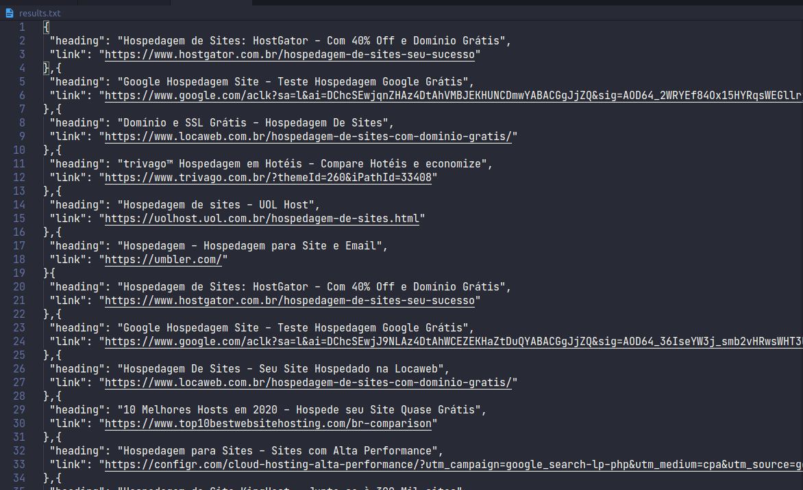

# Google Ads Scrapper 📢


Este projeto automatiza as buscas no Google e retorna um arquivo de texto com os anúncios das 10 primeiras páginas.

## Pré-requisitos

Você vai precisar instalar na sua máquina o [Git](https://git-scm.com) e o [Node.js](https://nodejs.org/pt-br/)

## Executando o projeto

```bash
# Clone esse repositório

git clone https://github.com/maur32/google-ads-scrapper.git

# Acesse a pasta do projeto

cd google-ads-scrapper

# Instale as dependências

npm install

# Execute o arquivo scrapper.js

node scrapper.js

# Digite o que vai ser pesquisado

Procurar por:
Hospedagem de sites #Exemplo
```

Quando finalizada a execução, um arquivo *results.txt* será gerado.

* Exemplo



## Licença

Veja o arquivo [License](https://github.com/maur32/google-ads-scrapper/blob/master/LICENSE)
